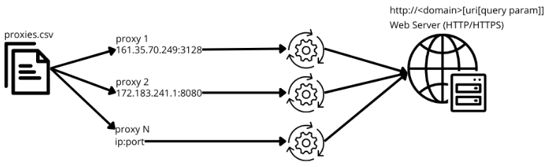

# PHP HTTP REQUEST PROXIER

It request a http web server N times with N proxy server.



# Web Server Simulation

You may request the "Web Server Simulator" executing:

```php
$ ./webserver_simulation.php
```

Change `RequestParams` `host` and `port` in `index.php` and it:

```php
$ php index.php
```